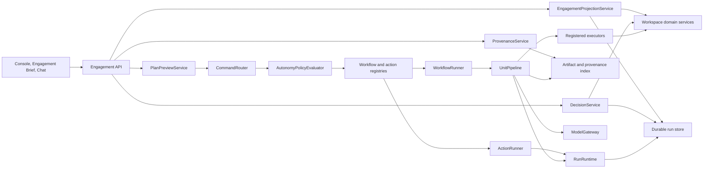

# Agent Backend Redesign Plan

**Status:** Proposed  
**Date:** 2026-07-30  
**Related documents:** [Agentic UX Plan](agentic-ux-plan.md), [Agent Architecture](agent-architecture.md)

## 1. Purpose

This plan defines the backend changes required to support the engagement-centered
agent experience described in `docs/agentic-ux-plan.md`.

The redesign should make the agent easier to understand and extend without
discarding the runtime properties that already work:

- durable, restart-safe runs;
- local-first execution and row-level privacy;
- revisioned workspace writes;
- deterministic capability dependencies;
- bounded model context and budgets;
- sidecar recovery around model proposals and commits;
- explicit auditor approvals and interactions;
- one live run per workspace.

The target is not another agent framework alongside the current one. The target
is a smaller application-facing contract over the existing durable runtime,
followed by consolidation of the internal registries, workflow adapters, and
routing layers.

## 2. Motivating Incident: “whats the status of the audit”

The last message in `Workspaces/exp` exposed two problems that this redesign must
solve.

### 2.1 Why an intent-classification call occurred

The message was:

> whats the status of the audit

The durable chat path first tries a deterministic Ask/Act classifier. That
classifier recognizes exact question words such as `what`, or a trailing `?`.
It did not normalize the apostrophe-less contraction `whats`, and the message
did not contain a question mark. The deterministic pass therefore returned no
result and invoked the model-based intent classifier.

This was not the workflow command router. It was an earlier chat-level
classification layer. A later Act request may also pass through the workflow
router, and an Action route can invoke the action command interpreter. The
system therefore has up to three interpretation layers:

1. chat Ask/Act classification;
2. workflow/action/clarification routing;
3. action graph interpretation for Action runs.

For a status question, only a deterministic read path should be necessary.

### 2.2 Why the following call took about 30 seconds

The slow operation was not the local `get_audit_progress` tool:

- intent classification: approximately 2.7 seconds;
- first assistant model call and tool selection: approximately 30.9 seconds;
- local audit-progress tool: approximately 0.3 seconds;
- final answer synthesis: approximately 7.9 seconds.

The first assistant call used
`nvidia/nemotron-3-ultra-550b-a55b:free`. Telemetry recorded approximately
0.7 seconds to receive response headers and 30.1 seconds reading the response
body. The delay was therefore provider/model generation latency, not workspace
I/O or audit computation.

The tool result was also large at roughly 11 KB. The response path then required
a second model call to summarize it. This is acceptable for open-ended analysis,
but wasteful for a common status request whose result can be projected
deterministically.

### 2.3 Immediate product implication

Status, progress, decisions, coverage, and provenance are product read models.
They should not depend on a model deciding which local tool to call. Chat can
still narrate those read models, but the backend should expose a fast,
deterministic engagement projection that both the UI and assistant can use.

## 3. Goals

### 3.1 Product goals

- Give the Console one authoritative engagement state.
- Present the complete audit plan, including satisfied and reused work.
- Turn unresolved blockers into stable, actionable decisions.
- Present assurance coverage as a mutually exclusive, explainable projection.
- Make provenance navigable from an artifact or claim to its actual run, unit,
  context, proposal, receipt, and source.
- Apply autonomy consistently before scheduling, model work, approval, and
  mutation.
- Let the auditor preview work, impact, and estimated cost before a run starts.
- Make common status questions deterministic and fast.

### 3.2 Engineering goals

- Reduce duplicated routing and execution binding.
- Make capability definitions the primary extension point.
- Replace hard-coded workflow dispatch branches with registry dispatch.
- Remove accidental inheritance between audit workflow execution and the action
  engine.
- Centralize approval and autonomy policy.
- Correlate every model call and artifact with its capability and unit.
- Prefer behavior and contract tests over source-shape tests.

### 3.3 Success measures

- A status request does not require an intent-classification or tool-selection
  model call.
- The engagement projection has a warm local target of under 250 ms and a cold
  local target of under 1 second for a representative workspace.
- Every visible plan node has a stable status and explanation.
- Decision counts are deduplicated and reconcile with their source records.
- Coverage categories are mutually exclusive and total to the scoped RCM rows.
- Every agent-created engagement artifact resolves to a provenance view.
- `Never` autonomy blocks work before any model call is reserved.
- A preview can be started exactly once or rejected as stale.
- Adding a capability does not require edits to a workflow-specific dispatch
  switch and multiple approval branches.

## 4. Design Principles

### 4.1 Product projections are deterministic

The UI should consume typed projections, not infer product state from raw run
records, transcript prose, or model narration.

### 4.2 Commands and queries are separate

Read-only engagement queries should go directly to projection services.
Commands that may schedule work or mutate state use the command routing and
policy path.

### 4.3 The runtime stays durable; adapters become smaller

The redesign preserves `RunRuntime`, `ModelGateway`, `UnitPipeline`, durable run
documents, sidecars, budgets, controls, and conflict-aware executors. It removes
duplicate application glue around those components.

### 4.4 Capability definitions are self-contained

A capability should declare:

- identity and dependencies;
- readiness and unit expansion;
- worker or deterministic computation;
- executor, if any;
- context preset;
- approval and autonomy behavior;
- budget-estimation behavior;
- user-facing presentation metadata.

Workflow definitions should select and connect capabilities. They should not
reconstruct those bindings in separate adapter modules.

### 4.5 Provenance must not overclaim

The existing context manifests prove what context was supplied to a worker.
They do not prove that every sentence in an output is supported by a specific
source. The initial provenance UI must describe artifact- and unit-level
lineage accurately. Claim-level evidence requires explicit worker output
contracts and is a later capability, not a presentation-only change.

### 4.6 Policy is evaluated at explicit gates

Autonomy is not a UI preference checked opportunistically by individual
adapters. It is a versioned policy evaluated at:

1. preview;
2. scheduling;
3. model execution;
4. proposal approval;
5. mutation commit;
6. outcome acceptance, where applicable.

## 5. Current Gaps

| Area | Current behavior | Required behavior |
|---|---|---|
| Chat intent | Brittle deterministic phrases, then model fallback | Normalized deterministic query intents for common reads |
| Routing | Ask/Act classification, command routing, then possible action interpretation | Query dispatch plus one command route; action interpretation only when truly needed |
| Engagement status | Assistant tool output and separate UI calculations | One shared engagement projection |
| Plan | Run stages include only scheduled work; reused capabilities are separate | Full graph projection with scheduled, satisfied, reused, blocked, skipped, and stale nodes |
| Decisions | Blockers live in several domain records and run interactions | Canonical deduplicated decision items with stable IDs and resolution actions |
| Coverage | Useful rollups exist, but classification and next move are spread across UI/domain code | One deterministic assurance projection |
| Provenance | Generic artifact lookup misses workflow sidecars; correlation fields are incomplete | Indexed unit-level lineage across manifests, proposals, receipts, calls, and artifacts |
| Autonomy | `mode == permission` checks are repeated in execution adapters | Central policy evaluator with persisted policy and run snapshot |
| Run start | Command creates and launches a run immediately | Preview, confirm, revalidate, then start |
| Capability binding | Definitions and runtime bindings are split | One registered capability contract |
| Workflow dispatch | Workflow IDs are selected with hard-coded branches | Registry lookup |
| Audit execution | Audit adapter inherits from `ActionRunner` | Composition over `BaseRunner`/runtime services |
| Tests | Many tests inspect source shape | Contract, behavior, recovery, privacy, and policy tests |

## 6. Target Architecture



The engagement API is an application layer. It does not replace the underlying
planning, RCM, document, test, finding, report, or run services. It composes
their bounded read models into contracts designed for the agentic UX.

## 7. Core Contracts

The examples below show contract shape, not final Python syntax.

### 7.1 `WorkspaceTarget`

Replace the dashboard-specific target with a shared target reference:

```json
{
  "kind": "workspace|planning|apm|rcm|rcm_row|document|doc_test|data_test|finding|report|analysis|dashboard|run|unit",
  "id": "stable-domain-id",
  "version": "optional content or revision hash",
  "label": "Human-readable name"
}
```

Requirements:

- validated against a registered target-kind table;
- JSON serializable and safe to persist in runs, decisions, and artifacts;
- supports canonical equality without depending on labels;
- resolvable to a route or product surface by the frontend;
- extensible through registration rather than a shared conditional chain.

### 7.2 `EngagementProjection`

`EngagementProjection` is the shared response for the Console header, status
cards, assistant status answers, and invalidation.

```json
{
  "workspace_id": "exp",
  "workspace_revision": 42,
  "projection_revision": "sha256:...",
  "generated_at": "2026-07-30T12:00:00Z",
  "lifecycle": {
    "phase": "fieldwork",
    "status": "attention_required",
    "percent_complete": 63,
    "summary": "Fieldwork is active; three decisions block five tests."
  },
  "counts": {
    "decisions_open": 3,
    "tests_ready": 4,
    "tests_running": 0,
    "tests_blocked": 5,
    "findings_open": 2
  },
  "active_run": null,
  "next_moves": [],
  "health": {
    "stale_artifacts": 1,
    "conflicts": 0,
    "failed_units": 5
  }
}
```

Rules:

- derive from domain state and durable runs only;
- do not call the provider;
- expose a concise machine-written summary assembled from templates;
- allow chat to optionally ask a model to rephrase, without changing facts;
- use a projection hash or revision for cache invalidation;
- keep counts reconcilable with the detail endpoints.

### 7.3 `PlanProjection`

The plan is the complete materialized workflow graph, not just the work that was
scheduled in one run.

```json
{
  "workflow_definition_id": "audit_workflow_v2",
  "workflow_hash": "sha256:...",
  "run_id": "optional",
  "nodes": [
    {
      "capability_id": "fieldwork.executed",
      "label": "Execute fieldwork",
      "status": "blocked",
      "status_reason": "Five units require auditor input",
      "depends_on": ["tests.specified"],
      "unlocks": ["rcm.results_rolled_up"],
      "units": {
        "total": 12,
        "satisfied": 7,
        "ready": 0,
        "running": 0,
        "blocked": 5,
        "failed": 0
      },
      "target": {"kind": "rcm", "id": "main"},
      "actions": []
    }
  ]
}
```

Node statuses:

- `satisfied`: current workspace state meets readiness;
- `reused`: satisfied by an existing compatible artifact;
- `ready`: dependencies are satisfied and units can be scheduled;
- `scheduled`;
- `running`;
- `awaiting_approval`;
- `awaiting_auditor`;
- `blocked`;
- `failed`;
- `stale`;
- `skipped`;
- `not_applicable`.

Requirements:

- include every capability in the selected workflow closure;
- distinguish current readiness from historical run execution;
- show why a node has its status;
- expose both direct dependencies and transitive consequences;
- use semantic unit IDs already produced by unit expansion;
- never infer plan state from stage labels or transcript text.

### 7.4 `DecisionItem`

The UX plan names five decision families but enumerates six underlying sources.
Those sources can overlap. The backend must normalize and deduplicate them.

Canonical decision kinds:

1. `structured_interaction`;
2. `approval_batch`;
3. `document_analysis_conflict`;
4. `report_reconciliation`;
5. `failed_unit_resolution`;
6. `manual_domain_blocker`.

```json
{
  "decision_id": "dec_sha256...",
  "kind": "failed_unit_resolution",
  "status": "open",
  "severity": "blocking",
  "title": "Resolve five failed document-test units",
  "summary": "Three provider failures affect five units.",
  "source_refs": [
    {"type": "run_unit", "run_id": "...", "unit_id": "..."}
  ],
  "target": {"kind": "doc_test", "id": "..."},
  "blocks": [
    {"capability_id": "fieldwork.executed", "unit_ids": ["..."]}
  ],
  "consequences": [
    {"capability_id": "rcm.results_rolled_up", "relationship": "transitive"}
  ],
  "resolution_actions": [
    {
      "action_id": "retry",
      "label": "Retry failed work",
      "requires_comment": false,
      "destructive": false
    }
  ],
  "created_at": "...",
  "updated_at": "..."
}
```

Decision identity:

- derive stable IDs from the canonical source identity, not display text;
- merge multiple records only when they represent the same required auditor
  choice;
- retain every `source_ref` after merging;
- compute blocking impact from graph reachability, not direct dependencies only;
- preserve resolved decisions in history even when the source record changes.

Resolution:

- validate the action against the decision kind;
- use idempotency keys;
- apply workspace revision checks where mutation occurs;
- record actor, timestamp, optional comment, previous state, and resulting refs;
- return the updated decision and engagement projection revision.

### 7.5 `CoverageProjection`

Coverage is calculated per RCM row using a mutually exclusive assurance state:

```text
not_ready
ready_not_tested
in_progress
tested_no_exception
tested_with_exception
blocked
not_applicable
```

Precedence must be explicit. A recommended initial order is:

1. `not_applicable`;
2. `blocked`;
3. `tested_with_exception`;
4. `tested_no_exception`;
5. `in_progress`;
6. `ready_not_tested`;
7. `not_ready`.

The projection includes:

- scoped RCM row count;
- count and percentage by assurance state;
- linked Document and Data Tests;
- latest dispositions and exceptions;
- missing coverage explanations;
- one deterministic recommended next move;
- drill-down target for every count.

The existing RCM execution and rollup services remain authoritative for test
facts. `CoverageProjection` owns only normalization and presentation semantics.

### 7.6 `ProvenanceView`

Initial provenance is artifact- and unit-level:

```json
{
  "subject": {
    "type": "artifact",
    "artifact_ref": "..."
  },
  "producer": {
    "run_id": "...",
    "workflow_definition_id": "...",
    "capability_id": "planning.apm_ready",
    "unit_id": "apm:main",
    "worker_id": "...",
    "executor_id": "..."
  },
  "lineage": {
    "context_manifest_ref": "...",
    "proposal_ref": "...",
    "receipt_ref": "...",
    "model_call_ids": ["..."]
  },
  "sources": [
    {
      "target": {"kind": "document", "id": "..."},
      "representation": "bounded_document_context",
      "content_hash": "sha256:...",
      "included": true,
      "omission_reason": null
    }
  ],
  "commit": {
    "parent_hash": "...",
    "result_hash": "...",
    "workspace_revision": 42
  },
  "limitations": [
    "Sources were supplied to the producing unit; sentence-level support was not asserted."
  ]
}
```

Required correlation changes:

- add `capability_id` and `unit_id` to artifact projections;
- give model calls a stable `model_call_id`;
- record `capability_id`, `unit_id`, worker identity, and context manifest on
  every model call;
- index workflow `contexts/`, `proposals/`, and `receipts/` sidecars;
- preserve hash-only provider provenance and content-free durable manifests;
- reject any API response that would expose row-level table data.

Claim-level provenance is a separate increment. It requires workers to return
typed claim/source anchors and executors to preserve them in artifacts.

### 7.7 `AutonomyPolicy`

Autonomy is stored per engagement and snapshotted into every preview and run.

```json
{
  "schema_version": 1,
  "revision": 3,
  "default": "ask",
  "rules": [
    {
      "scope": {"capability_id": "documents.analysis_generated"},
      "level": "auto"
    },
    {
      "scope": {"mutation_class": "report_replace"},
      "level": "never"
    }
  ],
  "updated_at": "...",
  "updated_by": "auditor"
}
```

Levels:

- `auto`: proceed at the applicable gate;
- `ask`: create an approval or interaction;
- `never`: block before performing the gated work.

Policy precedence:

1. explicit one-run override;
2. target-specific rule;
3. capability-specific rule;
4. mutation-class or risk-class rule;
5. workflow rule;
6. engagement default;
7. safe system default of `ask`.

Evaluation result:

```json
{
  "decision": "allow|ask|deny",
  "gate": "model_execution",
  "matched_rule": "...",
  "explanation": "Document analysis is allowed automatically for this engagement.",
  "policy_revision": 3
}
```

Important behaviors:

- `never` must prevent context resolution and model budget reservation;
- `ask` must use the existing durable approval/interaction machinery;
- the policy snapshot in a run is immutable;
- changing engagement policy affects future work, not already approved work;
- all evaluations are appended to durable run events.

### 7.8 `PlanPreview`

A preview materializes the proposed route and work without launching a run.

```json
{
  "preview_id": "...",
  "command": "Complete the remaining audit",
  "route": {
    "status": "resolved",
    "engine": "workflow",
    "workflow_definition_id": "audit_workflow_v2",
    "outcomes": ["audit.completed"]
  },
  "plan": {},
  "policy_snapshot": {},
  "estimate": {
    "units": 14,
    "model_calls_min": 9,
    "model_calls_max": 14,
    "prompt_tokens_estimate": 42000,
    "completion_tokens_estimate": 12000,
    "images_estimate": 0,
    "duration_class": "minutes",
    "confidence": "medium"
  },
  "assumptions": [],
  "workspace_revision": 42,
  "workflow_hash": "sha256:...",
  "expires_at": "..."
}
```

Starting from a preview must revalidate:

- workspace revision or relevant parent hashes;
- workflow definition hash;
- capability/worker/executor/context definition hashes;
- autonomy policy revision;
- selected targets;
- one-live-run rule.

If any material input changed, return `409 PreviewStale` with a fresh preview
link or replacement payload. A preview start uses an idempotency key so the same
preview cannot create duplicate runs.

Estimates are ranges, not promises. Each capability contributes a deterministic
unit and model-call estimate. Token estimates use context preset budgets and
worker completion limits rather than sending context to a provider.

## 8. API Plan

### 8.1 Engagement and plan

```text
GET /api/workspaces/{workspace_id}/engagement
GET /api/workspaces/{workspace_id}/agent/runs/{run_id}/plan
GET /api/workspaces/{workspace_id}/workflows/{workflow_id}/plan
```

The workflow plan endpoint supports an optional `outcome` filter and shows
current readiness without creating a run.

### 8.2 Decisions

```text
GET  /api/workspaces/{workspace_id}/decisions
GET  /api/workspaces/{workspace_id}/decisions/{decision_id}
POST /api/workspaces/{workspace_id}/decisions/{decision_id}/resolve
```

Filters include `status`, `kind`, `severity`, and target.

### 8.3 Coverage

```text
GET /api/workspaces/{workspace_id}/rcm/assurance
GET /api/workspaces/{workspace_id}/rcm/assurance/{rcm_row_id}
```

### 8.4 Provenance

```text
GET /api/workspaces/{workspace_id}/provenance?artifact_ref={ref}
GET /api/workspaces/{workspace_id}/agent/runs/{run_id}/units/{unit_id}/provenance
GET /api/workspaces/{workspace_id}/agent/model-calls/{model_call_id}
```

### 8.5 Autonomy

```text
GET /api/workspaces/{workspace_id}/autonomy
PUT /api/workspaces/{workspace_id}/autonomy
```

Updates require `If-Match` or a policy revision.

### 8.6 Preview and start

```text
POST /api/workspaces/{workspace_id}/agent/plan-previews
POST /api/workspaces/{workspace_id}/agent/runs/from-preview
```

The existing direct run endpoint remains during migration and internally creates
a short-lived preview before starting. Once all clients use the new flow, direct
start can be restricted to explicit low-risk actions or retained as an API
convenience with identical validation.

### 8.7 Query intents

The chat API should recognize normalized, deterministic query intents:

```text
engagement.status
engagement.decisions
engagement.coverage
run.status
artifact.provenance
```

Normalization includes punctuation removal, Unicode normalization, and common
contractions such as `what's`, `whats`, `what is`, `how's`, and `hows`.

These intents call projection services directly. They do not create agent runs.
An optional narration pass may be requested only when the user asks for analysis
or explanation beyond the deterministic answer.

## 9. Internal Framework Simplification

### 9.1 Consolidate capability declarations and bindings

Introduce a registered immutable `CapabilityDefinition`:

```python
CapabilityDefinition(
    capability_id=...,
    label=...,
    depends_on=...,
    readiness=...,
    expand_units=...,
    execution=ModelPipelineExecution(
        worker_id=...,
        executor_id=...,
        context_preset_id=...,
    ),
    approval_policy=...,
    estimate=...,
    presentation=...,
)
```

Deterministic and checkpoint capabilities use distinct typed execution variants.
Startup validation verifies that every workflow capability has exactly one
execution variant and that all referenced registrations exist.

This removes the need for workflow-specific modules to reconstruct worker,
executor, context, and approval bindings for each unit.

### 9.2 Registry-based workflow dispatch

Add a `WorkflowDefinitionRegistry` whose entries contain:

- workflow definition and hash;
- outcome aliases;
- capability set;
- optional domain projection adapter;
- plan presenter.

`workflow_dispatch.py` becomes a lookup plus validation. Adding a workflow does
not require editing a switch statement.

### 9.3 Remove audit/action inheritance

`AuditWorkflowExecution` should not inherit `ActionRunner`. Extract the small
shared projection helpers it uses into composition over:

- `BaseRunner`, or a narrower `RunProjectionWriter`;
- `RunRuntime`;
- registered capability execution services.

`ActionRunner` remains responsible only for isolated action graphs.

### 9.4 Centralize policy and approval

Delete adapter-local `run["mode"] == "permission"` decisions after all call
sites migrate to `AutonomyPolicyEvaluator`.

Pipeline and deterministic execution receive a policy evaluation, not a raw
mode flag. Approval providers become shared runtime services.

### 9.5 Separate query routing from command routing

The target flow is:

```text
message
  -> deterministic query-intent match
     -> projection response
  -> otherwise command-intent match
     -> deterministic command route
     -> one bounded router call only if unresolved
```

The action command interpreter remains inside the Action engine because it
produces an action DAG, not because it classifies Ask versus Act.

The chat-level model intent classifier should be retired after the deterministic
query and command paths cover supported inputs. Until then it is a final
fallback, with telemetry that records why deterministic matching failed.

### 9.6 Keep engines stable during the redesign

Do not combine Workflow, Action, and Intake engines merely to reduce the engine
count.

- Workflow is a dependency graph over durable workspace outcomes.
- Action is an isolated mutation graph.
- Intake is a one-unit protocol over staged batch state.

They can share runtime, policy, provenance, and projection services without
pretending their scheduling semantics are identical.

### 9.7 Replace import-side-effect registration

Registries should be assembled explicitly at application startup:

```python
agent_registry = build_agent_registry(
    workflows=[...],
    capabilities=[...],
    workers=[...],
    executors=[...],
    actions=[...],
    targets=[...],
)
agent_registry.validate()
```

This makes tests construct small registries without importing the entire agent
package and makes extensions easier to reason about.

## 10. Persistence and Migration

### 10.1 New durable records

Recommended locations:

```text
Workspaces/<id>/
|- Settings/
|  `- autonomy.json
|- AgentRuns/
|  |- <run_id>.json
|  `- <run_id>/
|     |- contexts/
|     |- proposals/
|     |- receipts/
|     `- provenance-index.json
`- Decisions/
   `- history.jsonl
```

Open decisions remain projections over authoritative source records. The
decision history stores resolutions and identity continuity; it must not become
a second mutable copy of every domain blocker.

### 10.2 Run schema additions

Add:

- `policy_snapshot`;
- `preview_id`;
- `workflow_hash`;
- `projection_revision`;
- per-unit policy evaluations;
- per-unit provenance refs;
- stable model call IDs;
- artifact `capability_id`, `unit_id`, and producer refs.

Use a new run schema version only when readers cannot safely default missing
fields. Older runs remain readable with `provenance_status: partial`.

### 10.3 Lazy provenance indexing

Existing runs can be indexed lazily:

1. read run projections;
2. scan known context/proposal/receipt directories;
3. validate identities and hashes;
4. build an in-memory or durable content-free index;
5. mark missing correlations explicitly.

Do not rewrite historical sidecars simply to satisfy the new API.

### 10.4 Compatibility

- Existing direct run creation continues during rollout.
- Existing `mode` is translated into a temporary policy snapshot.
- Existing run cards consume the new projection when available and fall back
  for old runs.
- Existing workflow IDs and semantic unit IDs remain stable.
- No workspace artifact is silently regenerated during migration.

## 11. Events, Caching, and Invalidation

Extend the current event stream with typed invalidation events:

```text
engagement_projection_changed
plan_projection_changed
decisions_changed
coverage_changed
autonomy_changed
provenance_available
preview_stale
```

Each event carries:

- workspace ID;
- workspace revision;
- projection revision;
- optional run, capability, unit, decision, or target reference.

The frontend treats events as invalidation hints and refetches the relevant
projection. It should not rebuild canonical state by replaying events.

Projection endpoints support `ETag` and `If-None-Match`. Expensive derived
projections may be cached by:

```text
(workspace_revision, active_run_revision, workflow_hash, policy_revision)
```

## 12. Privacy and Safety Requirements

- No row-level table values enter engagement, decision, plan, preview, or
  provenance responses.
- Preview estimation does not call a provider.
- Context manifests remain content-free.
- Provenance sources expose identifiers, hashes, representations, and omission
  reasons, not hidden context payloads.
- A model cannot override autonomy policy or executor preconditions.
- `never` is enforced before model work and before mutation.
- Decision resolution uses target validation, optimistic concurrency, and
  idempotency.
- Artifact download or source opening continues through existing guarded domain
  routes.
- Projection summaries must not invent facts to make status prose smoother.

## 13. Delivery Phases

### Phase B0 — Status Fast Path and Telemetry

Deliver:

- normalize `whats`, `what's`, punctuation, and related query phrases;
- deterministic `engagement.status` query intent;
- compact audit-status projection used by the assistant;
- telemetry fields for deterministic classification miss reason;
- separate model wait, local tool, and projection timing in debug views;
- response-size metrics for assistant tools.

Acceptance:

- “whats the status of the audit” uses no classification or tool-selection
  model call;
- the response reconciles with domain counts;
- unit/provider failures are not collapsed into misleading totals.

### Phase B1 — Projection Foundation

Deliver:

- `WorkspaceTarget` registry and validation;
- `EngagementProjectionService`;
- full `PlanProjection`;
- projection revision and ETag support;
- typed invalidation events.

Acceptance:

- every audit workflow capability appears in the plan;
- reused and satisfied nodes are visible;
- Console and assistant status use the same facts;
- old runs remain readable.

This phase is the minimum backend foundation for the Console plan spine in the
UX plan.

### Phase B2 — Decisions and Consequence Graph

Deliver:

- decision source adapters;
- stable identity and deduplication;
- transitive consequence calculation;
- decision list/detail/resolve endpoints;
- decision history and idempotent resolution;
- `engagement.decisions` chat query.

Acceptance:

- counts reconcile with detail records;
- one underlying auditor choice appears once even if multiple projections refer
  to it;
- resolution updates both the source domain record and engagement projection;
- a stale or repeated resolution is safe.

### Phase B3 — Assurance Coverage

Deliver:

- mutually exclusive assurance states and precedence;
- workspace and RCM-row coverage endpoints;
- deterministic next-move selection;
- drill-down targets;
- coverage invalidation events.

Acceptance:

- category counts total exactly to scoped RCM rows;
- every category has an explanation;
- repeated calculation is deterministic;
- no frontend-only rule is needed to assign assurance state.

### Phase B4 — Provenance Correlation

Deliver:

- model call IDs and unit/capability correlation;
- artifact producer correlation;
- sidecar provenance index;
- artifact and unit provenance endpoints;
- partial-provenance behavior for historical runs;
- explicit provenance limitation labels.

Acceptance:

- every newly generated artifact resolves to its producing run and unit;
- supplied and omitted sources are visible without content leakage;
- interrupted proposal/commit recovery still does not rebill;
- privacy tests reject row data in all provenance shapes.

### Phase B5 — Autonomy Policy

Deliver:

- persisted versioned engagement policy;
- policy evaluator and precedence;
- immutable run policy snapshots;
- pipeline and executor gates;
- migration from run `mode`;
- autonomy API and events.

Acceptance:

- `never` causes zero model calls and zero mutations;
- `ask` resumes through existing durable approvals;
- `auto` does not create redundant approval objects;
- policy changes do not retroactively alter a running unit;
- every evaluation has a human-readable explanation.

### Phase B6 — Engagement Brief and Plan Preview

Deliver:

- capability estimators;
- preview persistence and expiry;
- preview API;
- start-from-preview API;
- stale-preview revalidation;
- one-run overrides;
- deterministic duration classes and confidence.

Acceptance:

- preview creation performs no provider call and no workspace mutation;
- starting twice with the same idempotency key creates one run;
- a changed relevant parent hash rejects the preview;
- the run plan matches the confirmed preview or reports the exact revalidation
  difference.

### Phase B7 — Capability and Dispatch Consolidation

Deliver:

- self-contained capability definitions;
- registry-based workflow dispatch;
- explicit registry assembly;
- centralized approval/policy binding;
- removal of `AuditWorkflowExecution` inheritance from `ActionRunner`;
- deletion of migrated adapter duplication.

Acceptance:

- startup validation catches missing or invalid bindings;
- a small test workflow can be registered without editing dispatch code;
- existing workflow hashes change only when their definitions actually change;
- recovery, budgets, cancellation, pause/resume, inbox, and one-live-run behavior
  remain intact.

### Phase B8 — Routing Cleanup and Contract-Test Migration

Deliver:

- retire chat model intent classification where query/command routing covers it;
- document the remaining reasons for bounded router use;
- replace source-shape tests with registry and runtime contract tests;
- retain static tests only for privacy and provider-call choke points;
- update architecture and protocol decision records.

Acceptance:

- each message has one recorded query or command route;
- routing telemetry explains deterministic and model decisions;
- no action is claimed by multiple engines;
- the repository contains all decision records referenced by tests and docs.

## 14. Testing Strategy

### 14.1 Projection contract tests

- complete plan node enumeration;
- node status precedence;
- engagement/detail count reconciliation;
- coverage partition totals;
- stable target serialization;
- ETag stability and invalidation.

### 14.2 Decision tests

- stable IDs across reloads;
- overlap and deduplication;
- transitive consequence calculation;
- resolution idempotency;
- optimistic concurrency;
- resolved-history continuity.

### 14.3 Policy tests

- precedence matrix;
- all six evaluation gates;
- `never` before context/model work;
- run snapshot immutability;
- safe default when policy is missing or invalid.

### 14.4 Preview tests

- no provider call;
- unit and model-call estimate boundaries;
- expiry;
- stale workspace, workflow, registry, target, and policy cases;
- idempotent start;
- one-live-run conflict.

### 14.5 Provenance tests

- context/proposal/receipt correlation;
- model call correlation;
- interrupted commit reconciliation;
- old-run partial lineage;
- hash validation;
- row-level privacy rejection.

### 14.6 Runtime regression tests

Preserve coverage for:

- turn and token budgets;
- deadline extension during auditor waits;
- cancellation, pause, and resume;
- offline auditor response recovery;
- queued command continuation after failure;
- deterministic all-settled ordering;
- sidecar reuse without provider rebilling;
- compare-and-swap workspace commits.

### 14.7 Test-style guidance

Prefer:

- public registry validation;
- typed service contracts;
- persisted record round trips;
- end-to-end route/run behavior;
- failure and restart simulation.

Use source inspection only for architectural safety invariants that cannot be
expressed behaviorally, such as prohibiting direct provider calls outside
`ModelGateway` or domain imports inside the neutral scheduler.

## 15. UX Plan Corrections and Clarifications

The backend implementation should incorporate these clarifications to
`agentic-ux-plan.md`:

1. The proposed Decisions system has six source families in the current design,
   not five. Product-facing categories may be fewer, but source adapters must be
   explicit.
2. Decision counts cannot be summed from source collections because approval,
   interaction, failed unit, and reconciliation records can refer to the same
   blocked work.
3. The current run plan is not a complete engagement plan. Satisfied and reused
   capabilities must be added through a new projection.
4. Current context manifests support unit-level input lineage, not claim-level
   evidence. The UI must label that distinction.
5. Autonomy requires a new application policy and centralized evaluation. The
   existing approval gate is reusable infrastructure, not the complete feature.
6. Engagement Brief requires a preview/start protocol; it cannot be safely
   implemented by showing a command summary after the run has launched.
7. `WorkspaceTarget` is a new shared application contract, even if it grows from
   existing target structures.
8. Status suggestions currently come from several projections and narration
   paths. They should be replaced by deterministic `next_moves`, not described
   as a simple rename of `agent/suggest.py`.
9. “One engagement, one thread” needs an explicit product decision:
   either enforce one canonical engagement chat or present an engagement-wide
   projection that is independent of chat count. The backend should support the
   latter in all cases.

## 16. Non-Goals

- Replacing Polars or the local-first workspace model.
- Sending row-level data to a model.
- Rewriting the workflow scheduler before the UX read models exist.
- Merging Workflow, Action, and Intake into one artificial scheduling model.
- Automatically accepting generated document analyses or test dispositions on
  behalf of the auditor.
- Claiming sentence-level evidence without worker-produced source anchors.
- Predicting provider latency or monetary cost with false precision.
- Replacing domain services with a generic artifact database.
- Migrating all historical runs eagerly.

## 17. Risks and Mitigations

| Risk | Mitigation |
|---|---|
| Projection becomes a second source of truth | Keep it read-only and derive from authoritative domain/run records |
| Decision dedup hides distinct choices | Stable source identities, conservative merge rules, retained source refs |
| Full plan calculation is expensive | Cache by revisions and hashes; keep readiness checks deterministic |
| Provenance UI implies stronger evidence than exists | Explicit lineage level and limitations in the API |
| Autonomy bypass in legacy adapters | Deny-by-default centralized gates and temporary parity tests |
| Preview differs from execution | Hash/revision revalidation and start-from-preview idempotency |
| Registry consolidation changes workflow hashes | Version definitions deliberately and test semantic equivalence |
| More APIs increase surface area | Thin projection routes over shared services and generated frontend types |
| Status prose becomes inconsistent | Deterministic summaries from the same projection; model narration is optional |

## 18. Recommended First Slice

Implement Phases B0 and B1 together as the first vertical slice:

1. add `WorkspaceTarget`;
2. add `EngagementProjectionService`;
3. add the full plan projection;
4. expose engagement and plan endpoints;
5. route common status questions directly to the engagement projection;
6. update the Console to consume those endpoints;
7. add projection timing and classification-miss telemetry.

This slice fixes the observed status latency, establishes the backend spine for
the redesigned Console, and creates the shared identifiers needed by Decisions,
Coverage, Provenance, Autonomy, and Engagement Brief.

Do not begin by refactoring the scheduler. The application contracts should
first make the required behavior explicit. Internal consolidation can then be
measured against those contracts rather than against implementation shape.

## 19. Definition of Done

The backend redesign is complete when:

- Console, chat status, decisions, coverage, and provenance use shared typed
  projections;
- the plan shows the complete workflow graph and current readiness;
- decisions are stable, deduplicated, actionable, and auditable;
- assurance coverage is deterministic and fully reconcilable;
- new artifacts have navigable unit-level provenance;
- autonomy is persisted, explained, and enforced at every gate;
- runs can be previewed, confirmed, revalidated, and started idempotently;
- capability execution bindings live in one registered definition;
- workflow dispatch is registry-based;
- audit workflow execution no longer inherits the action engine;
- common read-only questions require no model routing;
- privacy, durability, restart, budget, and concurrency guarantees continue to
  pass behavioral tests;
- architecture and protocol decision documents match the shipped
  implementation.
