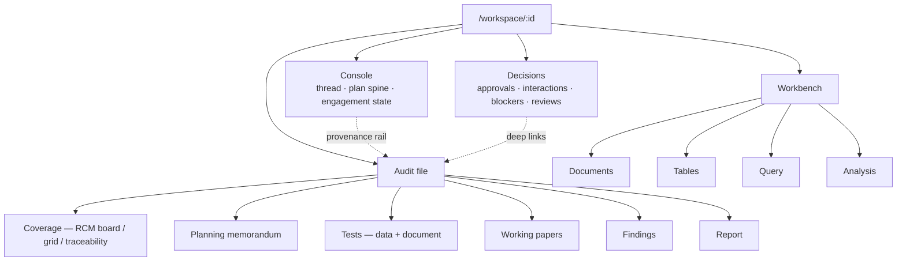

# Agentic UX Plan

**Status:** Phases 1–5 and 7 implemented; phase 6 (autonomy policy) deferred by the product owner
**Date:** 2026-07-30
**Visual mockups:** <https://claude.ai/code/artifact/edccf5ca-da17-401e-aa61-7bade42b3f83>
**Primary objective:** Reshape the SPA so its information architecture matches the agent runtime's outcome graph rather than the storage taxonomy, moving the auditor from *operator* to *director, reviewer, and signatory* — without removing any manual capability.

## 1. Executive decision

The workspace UI will be reorganised from **eleven artifact-typed tabs plus a collapsed assistant drawer** into **four surfaces**:

| Surface | Job | Route |
|---|---|---|
| **Console** | Direct the agent; watch the plan execute | `/workspace/:id` |
| **Decisions** | Resolve everything blocked on a human | `/workspace/:id/decisions` |
| **Audit file** | Read and edit the work product | `/workspace/:id/file/*` |
| **Workbench** | Drive the agent's own tools by hand | `/workspace/:id/bench/*` |

The agent drawer is promoted to the Console — the default landing surface of a workspace. Every current tab survives as a route under Audit file or Workbench. No backend concept is invented; four of the six new surfaces are pure front-end reorganisations over data the API already returns.

This is not a re-skin. The change is that the product's primary screen becomes *the agent working*, and the auditor's primary interaction becomes *approving, redirecting, and signing* rather than *navigating and authoring*.

## 2. Why the current UI fights the runtime

### 2.1 Two incompatible mental models

The nav rail groups destinations as **Overview / Data / Plan / Fieldwork / Output** — a taxonomy of what the system *stores*. The runtime schedules **outcomes**: `documents.analysis_generated` → `planning.context_ready` → `planning.apm_ready` → `planning.rcm_ready` → `tests.specified` → `fieldwork.executed` → `results.rolled_up` → {`findings.drafted`, `working_papers.generated`, `dashboard.curated`} → `report.working_draft` → `audit.verified` (`agent/workflows/audit.py`, `WORKFLOW_ID = "audit_workflow_v3"`).

The dependency graph is the product's actual intelligence and it is never drawn. The auditor performs the translation in their head, continuously.

### 2.2 Four concrete symptoms

1. **The agent occupies a 416px collapsed sidecar.** `AgentDrawer.vue` renders narration, blockers, approvals, interactions, artifact commits, steering, chat history, and the composer into a column narrower than a phone. `MAX_WIDTH` is 680px and the default is 416px. The most capable part of the product has the least screen.

2. **Pending human work is scattered across five surfaces.** Verified against the Procurement workspace on 2026-07-30:
   - Dashboard → "Needs attention: 10"
   - Document tests → "Need review: 3", "Awaiting evidence: 3"
   - RCM → seventeen rows all reading `REVIEW: DRAFT`
   - Findings → observation dispositions
   - Agent drawer → pending `AgentApproval` / `AgentInteraction`

   There is no single answer to "what does the agent need from me?", which is the only question that matters in autonomous operation.

3. **The RCM is a manual matrix with AI buttons stapled on.** Eleven columns × seventeen rows, with a per-row *Generate test* button. Every row currently reads `NOT ASSESSED / NO_CONCLUSION / DRAFT`, so the grid communicates nothing at a glance — including the fact that two Critical risks have zero tests.

4. **Provenance is persisted and never surfaced.** Every `WorkflowUnit` carries `context_manifest`, `proposal_sidecar`, and `receipt_sidecar` (`WorkflowSidecarReference` with `sha1`, `manifest_hash`, `payload_hash`, `receipt_hash`). `ContextManifest` records what was selected, omitted, and truncated. `AgentRun.usage.model_usage_by_worker` records per-worker model accounting. None of it is readable through any API or screen. For an audit product this is the single largest unrealised asset in the codebase. *(Addressed in phase 5.)*

## 3. Design principles

1. **One engagement, one thread.** The conversation is the spine, not a feature. Objective, plan, progress, decisions, and commits live in one durable, replayable thread.
2. **The plan is visible, and it is the real plan.** Render `AgentWorkflow.stages[]` with `readiness_before.blocking_on` — not a decorative progress bar. An auditor who can see the plan can redirect it before it spends forty model calls.
3. **Decisions are a queue, not an interruption.** Human work is batched into one keyboard-driven surface, ordered by how much downstream work each decision unblocks.
4. **Nothing the agent asserts is unattributed.** Every generated sentence is one interaction from the documents, pages, rows, model, and receipt that produced it — including what the model did *not* read.
5. **Manual control is demoted, never removed.** Query, Polars authoring, validation rulesets, and the RCM grid remain exactly as capable. They move behind Workbench, framed as "the same tools the agent uses, driven by hand." An audit tool that cannot be overridden is not usable by an auditor who must defend the file.
6. **Deterministic state stays deterministic.** Nothing in this plan moves a gate, roll-up, or quality check from code into model judgement. The UI exposes the runtime's decisions; it does not replace them.

## 4. Target information architecture



### 4.1 Route map

| New route | Replaces | Component |
|---|---|---|
| `/workspace/:id` | `?tab=dashboard` + drawer | `ConsoleView.vue` (new) |
| `/workspace/:id/decisions` | — | `DecisionsView.vue` (new) |
| `/workspace/:id/file/coverage` | `?tab=rcm` | `CoverageView.vue` wrapping `RcmGrid.vue` |
| `/workspace/:id/file/apm` | `?tab=apm` | `PlanningTab.vue` (`section="apm"`) |
| `/workspace/:id/file/tests` | `?tab=data-tests`, `?tab=doc-tests` | `DataTestsTab.vue`, `DocTestsTab.vue` |
| `/workspace/:id/file/findings` | `?tab=findings` | `FindingsTab.vue` |
| `/workspace/:id/file/report` | `?tab=report` | `ReportTab.vue` |
| `/workspace/:id/bench/documents` | `?tab=documents` | `DocumentsTab.vue` |
| `/workspace/:id/bench/tables` | `?tab=data` | `DataTab.vue` |
| `/workspace/:id/bench/query` | `?tab=query` | `QueryTab.vue` |
| `/workspace/:id/bench/analysis` | `?tab=analysis` | `AnalysisTab.vue` |
| `/workspace/:id/settings/autonomy` | composer mode dropdown | `AutonomyView.vue` (new) |
| `/workspace/:id/debug` | unchanged | `DebugView.vue` |

Legacy `?tab=` deep links must keep working. Add a `beforeEnter` redirect table on `/workspace/:id` that maps every current tab value — including the existing `validation` → `data` and `planning` + `view=rcm` → `rcm` normalisations in `WorkspaceView.vue` — onto the new paths, preserving destination-owned query keys. `useWorkspaceNavigation.ts` becomes path-based: `workspaceQuery(tab, state)` is replaced by `workspaceRoute(target)` returning a `RouteLocationRaw`, with `ownedKeys` retained per destination.

`DashboardTarget.tab` is the existing navigation contract used by dashboard actions and attention items. It must be widened into a general `WorkspaceTarget` and used by *every* card, blocker, and decision — see §9.4.

## 5. Surface specifications

### 5.1 Console

Three columns inside the existing workspace header.

**Left — plan spine (≈232px).** The capability graph as a connected vertical timeline. One row per stage, in `DEPENDENCIES` topological order, with state from `WorkflowStage.status` and unit counts from `stage.units[]`. Below it, a *Blocked on* card driven by `AgentBlocker[]` and `readiness_before.blocking_on`, with the blocker's own `suggestions[].command` rendered as a one-click steering action.

Capability IDs are shown as small mono subtext, not as labels — the row label is auditor language ("Risk & control matrix"), the ID is the audit trail.

**Centre — thread.** Today's `ChatTranscript.vue` + `ChatComposer.vue`, unchanged in substance, at full content width. Three changes:
- Narration entries render as a compact timestamped list under the run card rather than a separate collapsible.
- `AgentApproval.items[]` render as a **diff** (added / modified / withheld) rather than a flat list, with a primary batch action and a per-item escape hatch.
- Suggestion chips under the composer come from `AssistantChat.suggestions` (`agent/suggest.py`), which already computes what the engagement needs next.

**Right — engagement state (≈268px).** Coverage and fieldwork meters from `DashboardOverview`; a *Waiting on you* list (the top 4 of the Decisions queue, §5.2); a *Recent commits* list from `AgentRun.artifacts[]` plus workspace revision.

**Persistent across surfaces.** On Decisions / Audit file / Workbench the assistant remains available as today's drawer. This requires extracting the drawer's inner content into shared components so Console can render them full-width and the drawer can render them narrow:

```
components/agent/
  ConsoleThread.vue      (new — transcript + composer, layout-agnostic)
  PlanSpine.vue          (new — AgentWorkflow.stages renderer)
  EngagementState.vue    (new — meters + waiting + commits)
  AgentDrawer.vue        (retained — thin wrapper around ConsoleThread)
```

`useAgentRun` is already a module-scoped store keyed by workspace ID, so Console and the drawer observe the same run with no state work.

### 5.2 Decisions

One aggregated queue over five existing sources:

| Source | Type today |
|---|---|
| `AgentRun.approvals[]` where `status === 'pending'` | `AgentApproval` |
| `AgentRun.interactions[]` where `status === 'pending'` | `AgentInteraction` |
| `AssistantRunProjection.blockers[]` | `AgentBlocker` |
| Document-test items needing review | doc-test item state |
| Undisposed execution observations | findings triage |
| `DashboardPayload.attention[]` | `DashboardAttention` |

Master/detail. List left with severity stripe, title, source context, and age. Detail right with the agent's proposal, the evidence behind it, and the decision actions. Keyboard: `j`/`k` move, `a` accept, `e` edit, `r` reject, `Enter` open target.

**The consequence line.** Each decision states what it unblocks: *"If accepted, drafts 1 finding and unblocks `report.working_draft`."* This is a reverse-walk of `workflows/audit.py::DEPENDENCIES` and is the highest-value copy on the screen — it converts a sign-off from bureaucracy into a lever. Implement as a helper in `workflows/audit.py`:

```python
def unblocked_by(capability_id: str) -> tuple[str, ...]:
    """Capabilities whose dependencies include this one."""
```

Filter segments: All / Approvals / Conclusions / Blockers. When the run is paused awaiting decisions, the header says so and offers Resume.

### 5.3 Coverage board (Audit file → Coverage)

The same RCM records, grouped by **state of assurance** into four columns:

| Column | Membership rule |
|---|---|
| **No coverage** | 0 linked tests |
| **Agent testing** | ≥1 linked test, execution incomplete, no pending human item |
| **Needs you** | Pending review, pending conclusion, or awaiting evidence |
| **Concluded** | Conclusion recorded and working paper generated |

Each card: RCM ID (mono), risk title, rating pill with a left severity stripe, exception/test count, and — the agentic part — **the agent's proposed next move** printed on the card ("Agent can specify a data test on `po_header`", "No reliable population — scope limitation"). Column headers carry the alarming aggregate ("No coverage · 6 · **2 critical**") and the surface header offers *Ask the agent to cover them* as a single action.

`Board / Grid / Traceability` is a view toggle. **Grid is the existing `RcmGrid.vue`, unchanged**, and remains the surface for bulk edit and export.

### 5.4 Provenance rail

Selecting a paragraph, conclusion, test result, or finding opens a right rail resolving:

- **Sources in context** — documents, page ranges, and character counts actually supplied, from `ContextManifest`.
- **Not supplied** — truncated and omitted sources with the reason. *This card matters as much as the first;* a reviewer's first question about an AI-drafted memo is what it did not read.
- **Generation** — capability ID, worker, model/provider, context manifest hash, token counts, receipt hash, committed workspace revision.
- **Trust** — whether every claim traces to a supplied source, plus a jump-to-page action into the Documents viewer.

This is the only surface requiring meaningful backend work (§6.2).

### 5.5 Autonomy policy

Replaces the binary `auto` / `permission` toggle currently stored in `localStorage` under `audit-workbench:agent-mode` and selected from the composer.

Three settings per capability — **On its own / Ask first / Never** — grouped by consequence:

| Group | Capabilities | Default (Supervised) |
|---|---|---|
| Reading and analysis | `documents.analysis_generated`, `data.joins_ready`, `analysis.executed` | On its own |
| Planning | `planning.apm_ready` | On its own |
| Planning | `planning.rcm_ready`, `tests.specified` | Ask first |
| Assertions | `fieldwork.executed` | On its own |
| Assertions | `results.rolled_up`, `findings.drafted` | Ask first |
| Assertions | `report.working_draft` | Never (auto-finalise) |

Plus cross-cutting overrides: *Always ask on Critical risks*; *Stop and ask when a test finds no reliable population* (rather than recording a scope limitation unprompted).

Presets: **Draft only**, **Supervised** (default), **Custom**. See §10.2 on why *Autonomous* is deliberately not a shipped preset.

This maps onto the existing `approval` field of a `Capability` declaration, which the runtime already gates on. The change is making the gate policy per-engagement persisted data rather than a global two-state toggle.

### 5.6 Engagement brief

Replaces the name-only `New workspace` dialog in `HomeView.vue`. Collects the one thing the agent cannot infer — *what are we auditing and why* — in free text, alongside the audit folder (existing `ImportDialog` staging) and an optional methodology pack.

The agent responds with a **proposed plan** before anything runs: the outcomes it intends, where it will stop for the auditor, and a cost estimate ("~180 model calls · roughly 25 minutes on your local model · nothing leaves this machine"). Actions: *Approve and start* / *Change autonomy* / *Plan only, don't run*.

The cost line is not decorative. Local-model runs are slow; stating the cost before commitment is the difference between a tool an auditor trusts and one they babysit.

## 6. Backend work required

### 6.1 Decisions aggregation — small

`GET /api/workspaces/{id}/decisions` returning a normalised list:

```
{ id, kind, severity, title, context, created_at, source_ref,
  target: WorkspaceTarget, unblocks: string[], actions: [...] }
```

Assembled from the six sources in §5.2. No new persistence.

### 6.2 Sidecar read API — the one real build

`GET /api/workspaces/{id}/agent/runs/{run_id}/units/{unit_id}/provenance`

Resolves `context_manifest`, `proposal_sidecar`, and `receipt_sidecar` paths into a bounded, JSON-safe response: supplied sources with page ranges and character counts, omitted/truncated entries with reasons, hashes, model provenance from `usage.model_usage_by_worker`, and the committed workspace revision.

Constraints: read-only; must not re-materialise raw document text into the response beyond what the manifest already bounds; must fail closed with a clear state when a sidecar file is missing rather than fabricating a partial record.

Secondary: artifact-level resolution (`which unit produced this APM section / this conclusion / this finding`) needs a lookup from `semantic_id` in `AgentRun.artifacts[]` back to the producing unit.

### 6.3 Autonomy policy persistence — small

`GET` / `PUT /api/workspaces/{id}/autonomy` storing a per-capability map plus overrides on the workspace record. `RunRuntime` reads it when evaluating a capability's `approval` gate, falling back to the current global mode when absent.

### 6.4 Dependency reverse-walk — trivial

`unblocked_by()` in `workflows/audit.py` (§5.2). Pure derivation from an existing constant; unit-testable in isolation.

## 7. Phasing

Each phase must pass both existing gates before the next begins:

```bash
cd backend && uv run --no-project pytest
```

```bash
cd frontend && npm run build
```

### Phase 1 — Promote the drawer to a route — **done (2026-07-30)**

The cheapest change with the largest perceptual shift, and the prerequisite for everything else.

**As-built deviations from the route map in §4.1**

1. **Data tests and document tests keep separate routes** (`/file/data-tests`, `/file/doc-tests`) rather than merging into `/file/tests`. Merging is §10 open decision 4 and is a larger change than a route move.
2. **The curated dashboard moved to `/file/dashboard`** rather than being absorbed by the console. `dashboard.curated` is an audit outcome in the workflow graph, so the audit file is where it belongs, and nothing was lost from the tab shell.
3. **The plan spine was deferred whole to phase 2.** The console ships as two columns — thread plus engagement state — rather than three with a placeholder. The right rail is real: it renders workspace counts and `/dashboard/status` phases, which the shell already loaded.
4. **The legacy redirect is a global `beforeEach`, not a per-route `beforeEnter`.** A `?tab=` link followed from inside the workspace only changes the query, and `beforeEnter` does not re-run while the matched route record is unchanged — the per-route guard silently passed every in-app legacy link through.
5. **Decisions is absent from the surface switcher** until phase 3 builds it. Three surfaces ship; the fourth appears with its content.

**Also worth knowing**

- `workspaceQuery`/`cleanWorkspaceQuery` are gone. Navigation is `useWorkspaceNav()` — `nav.replace('rcm', { rcm: id })` — with destination names unchanged, so the ~25 call sites changed shape, not intent. `nav.replaceTarget()` handles server-supplied `DashboardTarget`s, which still speak the pre-surface vocabulary.
- The surface rail styles live in `style.css` as `ui-surface__*`, alongside the other `ui-*` primitives, and carry the `workspace-panel` container that `style.css` and `DocTestsTab` query against.
- `DataTab` and `QueryTab` stay mounted while the workbench is open, as they did under the tab shell. They render fragments, so each needed a wrapper element for `v-show` to apply — without it both rendered at once.

**Scope**
1. Extract `ConsoleThread.vue` from `AgentDrawer.vue`; the drawer becomes a thin width-constrained wrapper. No behaviour change to chats, runs, approvals, interactions, or SSE.
2. Convert `WorkspaceView.vue` from a PrimeVue `Tabs` container into a layout shell: header + four-surface switcher + `<router-view>`. Remove `TabList` / `TabPanels`; keep the header, `ImportDialog`, the window-level drop target, and the `onWorkspaceInvalidated` reload.
3. Add the route table in §4.1 with child routes and the legacy `?tab=` redirect layer.
4. Add `ConsoleView.vue` rendering `ConsoleThread` full-width, with `PlanSpine` and `EngagementState` stubbed as placeholders.
5. Replace `workspaceQuery` with a path-based `workspaceRoute` across all call sites (`DashboardTab`, `PostImportPlanningOffer`, and the tab-to-tab links).

**Acceptance**
- Every current `?tab=` URL, including `?tab=planning&view=rcm` and `?tab=validation`, resolves to the correct new route with destination-owned query keys preserved.
- The assistant is reachable on every surface; a run started on Console is visible from Audit file and vice versa (guaranteed by the module-scoped `useAgentRun` store, but assert it).
- Pause / resume / cancel / steer, SSE reattach after reload, and drawer resize persistence all behave as before.
- `npm run build` clean; no backend change, so pytest is unchanged.

### Phase 2 — Plan spine — **done (2026-07-30)**

Render `AgentWorkflow.stages[]` in `PlanSpine.vue`. No new endpoints. Makes the agent legible immediately and is the highest ratio of perceived intelligence to code written.

**Acceptance:** the spine reflects live `stage_update` / `unit_update` SSE events; blocked stages show `blocking_on` in auditor language; a run with no workflow (action or intake engine) degrades to a sensible non-graph state rather than rendering empty.

### Phase 3 — Decisions queue — **done (2026-07-30)**

`GET /decisions` (§6.1), `unblocked_by()` (§6.4), `DecisionsView.vue`, keyboard handling, and a count badge in the surface switcher.

**Acceptance:** the queue's count equals the sum of the five sources it replaces; resolving an item from the queue produces the identical backend effect as resolving it in its original surface; the consequence line is correct for every audit-workflow capability (unit-tested against `DEPENDENCIES`).

**As-built**

- `app/decisions.py` merges six sources and owns no state. `app/routes/decisions_routes.py` exposes one read-only `GET`.
- `unblocked_by()` names the direct dependents; `downstream_of()` counts the whole tail. The queue sorts on severity, then downstream count, then age — so clearing it top-down releases the most work soonest.
- Resolution adds no endpoints. Approvals and interactions render the console's own `AgentApprovalCard` / `AgentInteractionCard` and post to the same agent routes; a blocker's suggestions go through `chats.send` exactly as the composer does; everything else deep-links to the surface that owns it.

**The count is not a naive sum, and could not be**

Two sources genuinely overlapped, both found against real workspaces rather than by inspection:

1. Dashboard attention's `doctest:` rows restate document-test items the queue already carries per item. The whole prefix is dropped.
2. Report quality raises `unresolved_exception` once per open observation *and* once per document test whose exceptions lack an RCM observation. On the `exp` workspace that was 9 duplicate rows against 9 observations — every pending disposition appeared twice, once actionable and once as an inert report warning. Filtered by issue code, not by id prefix, because the code is what identifies the duplication.

The honest statement of the acceptance criterion is therefore: **no source loses an item, and no item arrives twice.** `test_decisions_queue.py` holds both, plus id uniqueness and item-shape stability.

**Deferred**

- Inline resolution was verified for the deep-link and blocker-steering paths. Neither workspace had a pending approval or interaction to exercise live, so those two cards are wired but unproven against a real gate; they fall back to the console when the run in the store is not the run the decision came from.
- Batch actions (approve several items at once) are not built. The queue is keyboard-navigable (`j`/`k`/`Enter`) but resolves one decision at a time.

### Phase 4 — Coverage board — **done (2026-07-30)**

View toggle on the existing RCM. `RcmGrid.vue` is untouched; `CoverageView.vue` owns the board and the toggle.

**Acceptance:** every RCM row appears in exactly one column; the board and grid agree on every row's state; export still runs from the grid.

**As-built deviation: the board is a view inside the planning surface, not a route-level `CoverageView.vue`**

The RCM surface's data, detail dialog, observation triage, and toolbar (generate, run all, import, export, refresh) all live in `PlanningTab.vue`. A route-level view would have had to duplicate them, which is exactly how a board and a grid come to disagree. Instead `CoverageBoard.vue` renders the same `data.rcm` array the grid renders, `PlanningTab` owns a persisted toggle, and `RcmGrid.vue` is untouched as planned. Agreement is structural rather than tested-for.

**Column rules** (`components/planning/coverage.ts`, exhaustive and mutually exclusive by construction)

| Column | Rule |
|---|---|
| No coverage | 0 linked tests — evaluated first, whatever else is recorded |
| Needs you | Open exceptions, tests awaiting review, blocked tests, or `review_status = review_required` |
| Concluded | A control conclusion other than `no_conclusion` recorded, and nothing pending |
| Agent testing | Everything else with at least one test |

"Needs you" deliberately outranks "Concluded": a concluded row with open exceptions is not finished work.

**A gap in the four states, found in the data**

A row whose tests are all complete but which carries no conclusion fits none of the four rules — execution is finished, so it is not "testing", and there is no conclusion, so it is not "concluded". On `exp` that was **every row in the Agent testing column**, all five reporting "1 of 1 test(s) complete", which reads as progress when nothing is progressing. The roll-up that owes the conclusion is the agent's (`results.rolled_up`), so the row stays in Agent testing and the card states the real outstanding item: *"Tests complete — awaiting roll-up conclusion."* If a fifth column is ever wanted, this is the one.

**Verified against both workspaces:** 17 of 17 rows placed exactly once, board IDs and grid IDs each matching the planning payload exactly, no duplicates, export present in both views, card click opening the existing RCM detail dialog, and the toggle persisting per workspace.

**Not built:** `Add risk` remains grid-only, as does bulk row editing. The board's hint line names the grid as the editing surface. The `Traceability` view in §5.3 is not built; the toggle is Board / Grid.

### Phase 5 — Provenance rail — **done (2026-07-30)**

Sidecar read API (§6.2) plus the rail. Do it last and ship it loudest — it is the defensibility story that differentiates this product.

**Acceptance:** a generated APM section resolves to its supplied and omitted sources; a missing or unreadable sidecar renders an explicit "provenance unavailable" state and never a partial or inferred one; no raw document text is returned beyond the manifest's declared bounds.

**As-built**

- `app/provenance.py` plus two read-only routes: `…/agent/runs/{run_id}/units/{unit_id}/provenance` and `…/provenance?artifact=<ref>`.
- `UnitSidecarStore.read_receipt_record` is the one runtime addition — reconstructing an `ExecutorReceipt` needs the request and definition that produced it, which a read-only caller does not have. It still validates the reference.
- `ProvenanceRail.vue` renders Sources / Not supplied / Generation / Trust, wired into the APM view behind a toggle and always-on in the RCM detail dialog.

**The content rule turned out to be structural, not a filter**

`ContextManifest` is content-free by construction — `ContextSelection` records a source ref, a hash, a selector, and a size, and the model layer actively rejects media records containing bytes, data URIs, or local paths. So the manifest passes through whole and the acceptance criterion holds by design rather than by sanitising.

The proposal sidecar is the opposite: it *is* the generated artifact — the drafted APM, the RCM rows. Only its hash is exposed, and a test asserts a known string planted in a proposal never appears anywhere in the provenance payload. Receipts are commit metadata end to end and pass through in full.

**Attribution is per artifact, not per section**

The acceptance line says "a generated APM section". The sidecars record at artifact granularity (`planning:apm`, `rcm:RCM-9FB041`, `doctest:DT-2A94198C`) because that is what a receipt claims — there is no per-paragraph record to resolve, and inventing one would be the exact failure this feature exists to prevent. The rail attributes the whole artifact and says so.

**The artifact index is the receipts themselves.** `resolve_artifact` scans receipts newest-run-first for one that claims the ref, so attribution is what a unit recorded writing, never inferred from ordering or naming. An artifact no run claims returns `unattributed` with a plain reason rather than an empty trail.

**Model usage is per worker, not per unit.** A stage fanning out over seventeen RCM rows shares one worker, and `model_usage_by_worker` is accounted at that level. The payload carries `scope: "worker_across_run"` and the rail prints "for this worker across the run" rather than implying the numbers belong to one unit.

**Verified against the real Procurement run:** the APM resolves to 18 supplied sources and 13 omissions (all "Global or per-source size limit reached"), `openrouter / nvidia/nemotron-3-ultra-550b-a55b:free`, 15,377 prompt tokens, 58s, receipt `85ebb56498fc…`, committed at revision 98. An RCM row resolves separately to the `rcm` unit at revision 115. `test_provenance.py` covers the four sidecar states, a deleted manifest file, a tampered manifest failing its identity check, and the proposal-withholding rule.

### Phase 6 — Autonomy policy — **deferred**

Independent of Phases 2–5; can land any time after Phase 1.

**Acceptance:** a capability set to *Ask first* always produces an approval before its executor commits; *Never* prevents scheduling with a clear reason rather than a silent skip; the Critical-risk override wins over a per-capability *On its own*.

### Phase 7 — Engagement brief — **done (2026-07-30)**

Conversational entry replacing the name dialog, plus the plan proposal and cost estimate.

**The brief is the planning context, not a new concept**

`planning.context` already holds `objective`, `entity`, `period`, `scope`, `materiality`, and `background_notes` — and `planning.context_ready` requires exactly `objective` and `scope`. So the brief writes straight into it, and a completed brief means the capability is **satisfied before the first run**: the agent opens at the memorandum instead of interviewing the auditor for something they just typed. Verified end to end on a real workspace.

**Two claims from the §5.6 mockup were wrong and are now computed**

1. **"Nothing leaves this machine."** Only true of a local model. This installation is configured against `openrouter`, so the screen reads *"Requests and bounded result previews go to openrouter"* with the model named. `destination()` derives locality from the provider and base URL, and a test asserts a cloud provider is never described as staying local.

2. **"~180 model calls · roughly 25 minutes."** Invented. `cost_estimate()` measures completed full-audit runs already recorded on this machine, and with fewer than two it returns `insufficient_history` with **no numbers at all** — currently *"No completed full audit has run on this machine yet, so there is nothing to measure from. This engagement will be the first."* On a screen whose entire purpose is informed consent, a fabricated number is worse than none.

Getting that filter right took three passes against real data: including non-completed runs produced a "slowest: 1490 minutes" from an interrupted run that sat waiting overnight — wall-clock that measured the auditor's absence, not the agent's work. Runs that reused everything and called no model were excluded for the same reason, and narrower runs are excluded because a two-minute analysis run says nothing about a full audit.

**Also as-built**

- The outcome list is the real dependency closure of `full_audit_working_draft` — 18 capabilities with their registered titles, in schedule order, with a test asserting no dependency is listed after something that needs it.
- The gate line is read from the launch mode rather than the per-capability policy, since phase 6 is not built.
- The primary action is **Create and add files**, landing on the import dialog: a full audit cannot start on an empty workspace, so "Approve and start" would have been a button that did nothing.
- A brief cannot write outside `BRIEF_FIELDS`; `created_by` and `apm_markdown` are rejected by `update_planning`, and a test covers it.

## 8. Non-goals

- **No capability, worker, executor, or context-spec changes.** The runtime's declarations are untouched. Context policy remains declaration-only per `agent-architecture.md`; nothing here introduces a runtime policy editor.
- **No removal of manual authoring.** Query, Polars step editing, validation rulesets, analytics authoring, the RCM grid, and manual finding entry all survive unchanged.
- **No change to determinism.** Roll-ups, traceability checks, report-quality gates, and completion enforcement stay in code.
- **No new persistence format for runs.** `store.RUN_ENGINES` stays `{workflow, action, intake}`.
- **`ProfileTab.vue` stays out of navigation** (per `AGENTS.md` §6).

## 9. Risks and objections

### 9.1 A chat-first audit tool can read as a toy to a partner-level reviewer

**Mitigation:** the thread is never the deliverable. Everything it produces lands in a conventional, printable audit file, and Audit file is one click from every screen. The conversation is the control surface, not the work product. Users who never type into the composer must still be able to complete an engagement.

### 9.2 Autonomy defaults are a liability decision, not a UX decision

Shipping an "Autonomous" preset means a model can write a conclusion into a file a human signs.

**Recommendation:** ship **Draft only** and **Supervised** only. Leave fully autonomous conclusion-writing behind an explicit, logged opt-in with a plain-language acknowledgement, or omit it entirely for v1. This is a decision for the product owner, not the implementation.

### 9.3 The Console makes local-model slowness visible

A drawer hides a 25-minute run; a plan spine advertises it. That is correct, but it raises the bar on progress copy: per-unit elapsed time, honest "still working" states, and explicit reassurance that leaving and returning is safe. SSE replay already makes that true — the UI has to say so.

### 9.4 Four surfaces still contain eleven screens

Consolidation only helps if the agent reliably navigates for the user. Every card, blocker, decision, and provenance reference must deep-link to the exact record. The existing `DashboardTarget` contract must become a universal `WorkspaceTarget` used everywhere, not a dashboard-only concept. If this slips, the redesign makes navigation *worse*, not better.

### 9.5 Extraction risk in Phase 1

`AgentDrawer.vue` is 206 lines of tightly coupled chat, run, approval, interaction, document-picker, and resize logic. Extracting `ConsoleThread` without regressing SSE reattach, foreign-run projection (`displayChat`), or the auto-open-on-attention behaviour is the main technical risk in the plan. It should be a mechanical extraction with no behaviour change in the same commit, verified against the existing frontend build gate before any Console-specific styling lands.

## 10. Open decisions

1. **Is "Autonomous" a shipped preset?** (§9.2) — product owner decision, blocks Phase 6 defaults.
2. **Does Audit file keep the assistant drawer, or rely on returning to Console?** Recommendation: keep the drawer; reading the file is exactly when an auditor wants to ask a question.
3. **Does the Decisions queue own resolution, or deep-link to the originating surface?** Recommendation: own resolution for approvals, interactions, and conclusions; deep-link for document-test item review, which needs the full item detail.
4. **Do Data tests and Document tests merge into one "Tests" surface under Audit file, or stay separate routes?** They already share an RCM-row parent; merging is coherent but is a larger change than Phase 4 assumes.
