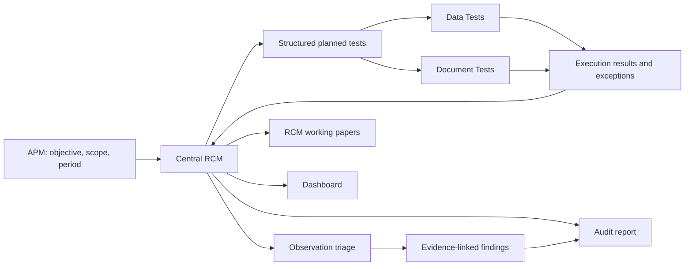

# RCM-Central Audit Workflow Plan

**Status:** Approved direction; implementation pending  
**Date:** 2026-07-19  
**Primary objective:** Make the Risk and Control Matrix (RCM) the central audit document, remove the separate Audit Program, and require every planned test to have corresponding execution in Data Tests, Document Tests, or both.

## 1. Executive decision

The engagement model will use:

- the Audit Planning Memorandum (APM) for engagement context, objective, scope, period, materiality, and background;
- the RCM as the single source of truth for risks, controls, planned tests, execution status, results, conclusions, evidence, exceptions, and findings;
- Data Tests and Document Tests as execution workspaces subordinate to an RCM planned test;
- RCM-linked working papers, dashboard tiles, findings, and report content as downstream outputs.

The separate Audit Program tab and active `work_program` model will be removed. Its useful fields will be migrated into structured planned-test definitions embedded in RCM rows.

The change must not be implemented as a cosmetic tab removal. Procedure setup, execution, results, evidence, and conclusions must be consolidated into the RCM data model so there is no hidden duplicate audit-program layer.

## 2. Target workflow



The full-run workflow is:

1. Import and classify data and documents.
2. Establish planning context and draft the APM.
3. Draft and validate the RCM.
4. Expand each RCM row into one or more structured planned tests.
5. Create a corresponding Data Test, Document Test, or both for every planned test.
6. Validate planned-test coverage before fieldwork begins.
7. Run all locally executable Data Tests.
8. Match evidence and run Document Tests.
9. Record manual-review work, unavailable evidence, and scope limitations explicitly.
10. Roll execution results into the RCM.
11. Triage every exception or warning.
12. Create evidence-supported draft findings where appropriate.
13. Generate RCM working papers.
14. Curate relevant dashboard tiles.
15. Generate an audit-report working draft from RCM outcomes and findings.
16. Run deterministic traceability, completion, and report-quality gates.

## 3. Design principles

1. **One audit spine.** The RCM is the only planning-and-fieldwork spine. There is no separate procedure collection with parallel results.
2. **No orphan planned tests.** Every planned test has at least one execution artifact or an explicit blocked state with an evidence request.
3. **No orphan execution artifacts.** Every engagement Data Test and Document Test identifies its RCM row and planned-test definition.
4. **No blank outcome after a full run.** Each planned test ends completed, blocked, not applicable, or awaiting auditor review, with a result or limitation.
5. **Results are durable.** Executing a test produces a reproducible, fingerprinted result artifact; code or configuration alone is not an execution result.
6. **Execution success is not semantic success.** A query that runs but has a zero-match join, null-only output, unintended row multiplication, or meaningless test design must be rejected or flagged.
7. **Exceptions precede findings.** Warnings and failed tests enter an observation-triage layer. They do not automatically become formal findings.
8. **Evidence is mandatory for formal findings.** Findings require an RCM link, planned-test link, execution source, and immutable evidence/result anchor.
9. **Automation must state its limits.** Inquiry, walkthrough, missing documentation, image-only evidence, and auditor judgment are recorded as open work, not silently omitted or fabricated.
10. **The orchestrator enforces completion.** LLM-generated plans may propose work, but deterministic code verifies coverage, dependencies, results, and terminal state.

## 4. Central RCM model

### 4.1 RCM row

Preserve the existing risk and control fields and add structured test and outcome data.

```json
{
  "id": "RCM-...",
  "semantic_id": "rcm:...",
  "process": "...",
  "risk": "...",
  "risk_rating": "high",
  "assertion": "Authorization",
  "control": "...",
  "control_type": "Preventive",
  "control_owner": "...",
  "criteria": "...",
  "criteria_refs": [],
  "planned_tests": [],
  "execution_rollup": {},
  "finding_refs": [],
  "evidence_refs": [],
  "prepared_by": null,
  "reviewed_by": null,
  "review_status": "draft",
  "updated": "..."
}
```

### 4.2 Planned-test definition

The UI may continue to label the compact grid column **Planned test**, but the stored form is a list so one RCM risk can support data, document, and hybrid responses without creating a separate Audit Program.

```json
{
  "id": "PT-...",
  "semantic_id": "planned-test:...",
  "title": "Test requisition management approval",
  "objective": "Determine whether ...",
  "criteria": "The procurement SOP requires ...",
  "method": "hybrid",
  "steps": [
    "Analyze the full population for missing approval fields.",
    "Inspect approval evidence for selected exceptions."
  ],
  "expected_evidence": "Population exception output and approval records.",
  "sampling": {
    "strategy": "exceptions_plus_representative",
    "size": 30,
    "seed": 42,
    "stratify_by": null
  },
  "thresholds": {},
  "execution_refs": [
    "datatest:DAT-...",
    "doctest:DT-..."
  ],
  "status": "in_progress",
  "result_summary": "...",
  "conclusion": "...",
  "control_conclusion": "partially_effective",
  "scope_limitations": "...",
  "exception_count": 4,
  "open_exception_count": 1,
  "evidence_refs": [],
  "finding_refs": [],
  "created_by": "agent",
  "agent_run_id": "...",
  "updated": "..."
}
```

### 4.3 Status vocabularies

Planned-test execution status:

- `not_ready`
- `ready`
- `in_progress`
- `review_required`
- `blocked`
- `completed_no_exception`
- `completed_with_exception`
- `not_applicable`

Control conclusion:

- `effective`
- `partially_effective`
- `ineffective`
- `no_conclusion`
- `not_applicable`

Review status:

- `draft`
- `prepared`
- `review_required`
- `reviewed`

Blank status, result, and conclusion fields are not valid terminal states for a full run.

## 5. Planned-test correspondence contract

Every planned test must have corresponding execution:

| Planned-test method | Required execution |
| --- | --- |
| Data analytics | At least one Data Test |
| Validation/data quality | At least one Data Test using the validation engine |
| Document inspection or vouching | At least one Document Test |
| Inquiry or walkthrough | A Document Test of type `review` or `qa`, retaining notes and evidence |
| Hybrid | At least one Data Test and one Document Test |
| Evidence unavailable | A linked blocked Document Test plus an evidence request |

Each execution artifact must retain both `rcm_id` and `planned_test_id`. An RCM-level link alone is insufficient when a row has more than one planned test.

Coverage validation must report:

- RCM rows without planned tests;
- planned tests without required execution artifacts;
- execution artifacts without valid RCM/planned-test parents;
- high/critical risks with only blocked or not-ready work;
- completed planned tests with no durable result;
- conclusions that are inconsistent with unresolved exceptions or limitations.

## 6. Data Tests

### 6.1 Product consolidation

Replace the fragmented user-facing Analysis and Validation workflows with one **Data Tests** area. Preserve their useful authoring capabilities as Data Test engines:

- validation rules;
- library analytics;
- custom Polars analyses;
- reconciliation or join tests;
- population exception tests;
- sampling and stratification tests.

The existing Library and Code editors become authoring modes inside Data Tests. Validation rules become a Data Test type rather than a separate engagement phase.

### 6.2 Durable Data Test model

```json
{
  "id": "DAT-...",
  "semantic_id": "datatest:...",
  "rcm_id": "RCM-...",
  "planned_test_id": "PT-...",
  "title": "Missing management approvals",
  "objective": "Identify requisitions ...",
  "engine": "analytics",
  "table_refs": ["requisitions"],
  "spec": {},
  "status": "completed_with_exception",
  "dataset_fingerprints": {},
  "last_run": {
    "run_at": "...",
    "verdict": "fail",
    "statistics": [],
    "summary_frame": {},
    "exception_frame": {},
    "exception_count": 4,
    "source_sha1": "..."
  },
  "auditor_disposition": "follow_up",
  "evidence_refs": [],
  "created_by": "agent",
  "agent_run_id": "..."
}
```

### 6.3 Execution requirements

- Creating or editing a Data Test validates its specification but does not count as execution.
- A full run must explicitly run every executable Data Test.
- Test execution persists a bounded summary and exception output, source fingerprints, and result hash.
- Dashboard tiles and findings reference the durable Data Test run, not an ephemeral agent receipt.
- Re-running against changed input preserves history and clearly marks the latest execution.
- Row-level exception evidence remains local and is referenced by stable table fingerprint and record locator.

### 6.4 Semantic validation

Reject or flag Data Tests with:

- zero or unexpectedly low join match rates;
- unexpected many-to-many row multiplication;
- result columns that are entirely null;
- empty results caused by unmatched joins;
- a condition that matched zero population rows;
- allowed values not grounded in observed or authoritative values;
- rare-value tests on naturally unique identifiers or names;
- Benford tests below the supported population threshold;
- outlier or Benford screening results represented as confirmed control failures;
- metric components or denominators that do not reconcile;
- result content unrelated to the parent planned-test objective.

The finance-approval analysis in the Procurement workspace is an acceptance case: joining requester department to approval designation matches 0 of 112 requisitions and must be rejected as an invalid test, not accepted as evidence of no exceptions.

## 7. Document Tests

### 7.1 Mandatory RCM linkage

Every engagement Document Test must store `rcm_id` and `planned_test_id`. Generic or exploratory document work may remain unassigned temporarily but cannot satisfy full-run coverage until assigned.

### 7.2 Evidence-aware creation

The full run must:

1. derive required document types and identifiers from the planned test;
2. extract or use imported transaction identifiers;
3. match documents to population records;
4. select evidence-covered transactions before random sampling;
5. attach matched documents automatically;
6. run deterministic comparisons on extractable evidence;
7. route image-only or ambiguous evidence to OCR/manual review;
8. create explicit evidence requests for uncovered samples;
9. roll test status and results into the planned test.

The Procurement acceptance case is the evidence package for `REQ2024009`, `PO2024004`, `GRN2024004`, and `INV2024004`. The full run should test that covered transaction rather than selecting ten random invoices that have no imported documents.

### 7.3 Blocked work

A missing document is not an empty result. It produces:

- test status `blocked` or `review_required`;
- the missing document type and transaction identifier;
- an evidence-request item;
- a scope limitation;
- a next action for the auditor.

## 8. RCM result roll-up

The RCM roll-up is computed from linked Data Tests and Document Tests and then optionally summarized by the model from bounded, grounded results.

Per planned test, show:

- required and linked execution artifacts;
- execution states;
- population and sample coverage;
- exception totals;
- open dispositions;
- evidence coverage;
- result summary;
- conclusion;
- scope limitations;
- finding links.

Per RCM row, show:

- total planned tests;
- completed, blocked, and review-required counts;
- total and open exceptions;
- control conclusion;
- finding count;
- review state.

The RCM grid's current **Results & findings** column should become **Execution status** and display the roll-up, not merely reference chips.

## 9. Observation triage and findings

### 9.1 Observation layer

Every exception-producing result receives one disposition:

- `confirmed_control_exception`
- `data_quality_issue`
- `expected_or_benign`
- `screening_follow_up`
- `invalid_test_or_result`
- `duplicate`
- `draft_finding_candidate`

The system may suggest a disposition, but auditor confirmation is required for a formal finding.

### 9.2 Finding requirements

A formal finding must include:

- `rcm_refs`;
- `planned_test_refs`;
- execution source references;
- at least one evidence anchor or reproducible result locator;
- condition;
- criteria;
- cause, or an explicit `cause_pending` state;
- effect/risk;
- recommendation;
- severity rationale;
- auditor confirmation.

Remove active dependence on `procedure_refs`. During migration, procedure references are resolved to their RCM and planned-test targets.

Benford deviation, outlier status, or a generic analytic warning is a screening signal, not a formal finding without corroboration.

## 10. Working papers

Replace procedure working papers with RCM working papers.

An RCM working paper contains:

- risk and control definition;
- criteria and sources;
- each planned test and its steps;
- linked Data Test and Document Test executions;
- population/sample coverage;
- exceptions and dispositions;
- evidence anchors;
- planned-test conclusions and limitations;
- overall control conclusion;
- linked findings;
- preparer/reviewer metadata;
- immutable source/result hashes.

Working-paper generation must consume all execution artifact kinds, not only Document Tests.

## 11. Dashboard

Dashboard curation occurs after RCM result roll-up. Candidate tiles are scored deterministically using:

- RCM risk rating;
- confirmed exception status;
- material population impact;
- management relevance;
- availability of a useful visualization;
- duplication with existing tiles.

Pin approximately four to six relevant results. Each tile links to its RCM row and Data Test or Document Test.

Recommended Procurement tiles:

- missing or invalid PO references;
- segregation-of-duties conflicts;
- three-way-match exceptions;
- procurement cycle time by department;
- approval sequence/backdating exceptions;
- vendor master integrity.

A full run with actionable results and no dashboard tiles must record why no tile was appropriate or fail dashboard coverage.

## 12. Report

The report context is built directly from:

- APM scope and engagement context;
- RCM risks, controls, planned tests, results, conclusions, and limitations;
- evidence-supported findings;
- unresolved fieldwork and management responses.

The report no longer reads a separate work program. Traceability is:

`report statement/finding -> RCM -> planned test -> execution result -> evidence`

If blocked or review-required work remains, the report may be generated only as a clearly labelled preliminary working draft. It must describe the open work and must not imply a final audit opinion.

## 13. Full-run orchestration

### 13.1 Deterministic phase requirements

The full-audit template must require:

1. valid APM planning context;
2. RCM creation or reconciliation;
3. structured planned tests;
4. execution-artifact coverage;
5. execution of all locally executable tests;
6. evidence requests for unavailable document work;
7. RCM outcome roll-up;
8. exception triage;
9. supported draft findings;
10. RCM working papers;
11. dashboard curation;
12. report generation;
13. traceability and quality checks.

These phases cannot depend solely on opportunistic LLM planning waves. The orchestrator must detect missing phases and add deterministic follow-up actions or end with open items.

### 13.2 Action lifecycle

Replace the procedure-oriented lifecycle with:

1. planning context and APM;
2. RCM and planned-test definitions;
3. Data Test and Document Test creation/linking;
4. test execution;
5. result roll-up and observation triage;
6. findings and RCM working papers;
7. dashboard curation;
8. report generation/reconciliation;
9. traceability and report quality.

Creation actions that return no execution result must not drive result interpretation. Result-producing actions must be planning-significant so their bounded outputs can drive triage, findings, dashboard selection, and conclusions.

### 13.3 Terminal statuses

- `completed`: all mandatory gates pass and no material audit work remains open.
- `completed_with_open_items`: safe automated work completed, but evidence, manual review, management response, or auditor judgment remains.
- `completed_with_issues`: technical or semantic execution failures remain.
- `failed`: the run could not establish a valid graph or could not safely perform required foundational work.

## 14. Completion and quality gates

A full run may be `completed` only when:

- required planning context is populated or explicitly limited;
- every high/critical RCM has at least one planned test;
- every planned test has the required Data Test or Document Test coverage;
- every executable test has a durable successful execution;
- every blocked test has a reason, evidence request, limitation, and next action;
- every exception has a disposition;
- every planned test has a result and conclusion or explicit limitation;
- every RCM has a control conclusion or justified `no_conclusion`;
- every formal finding has evidence and traceability;
- dashboard curation has completed;
- report quality and traceability checks pass.

The engagement-status calculation must use these gates. The presence of an RCM and planned tests alone is not sufficient to mark planning or fieldwork complete.

## 15. UX plan

### 15.1 Planning

Planning contains only:

- APM;
- RCM.

Remove the Audit Program tab.

### 15.2 RCM grid

Recommended columns:

- ID;
- process;
- risk;
- rating;
- control;
- planned test summary;
- test method;
- execution status;
- coverage;
- exceptions;
- conclusion;
- findings;
- review status.

Row expansion or a detail drawer contains:

- full planned-test definitions and steps;
- criteria and expected evidence;
- Create Data Test and Create Document Test actions;
- linked execution cards;
- result summaries;
- evidence requests;
- exception dispositions;
- conclusions and limitations;
- RCM working-paper preview;
- finding links and creation action.

### 15.3 Data Tests

Replace the Analysis and Validation engagement tabs with a Data Tests tab containing:

- test rail and filters by RCM, status, engine, and verdict;
- Library, Validation, and Code authoring modes;
- durable execution history;
- summary and exception results;
- disposition controls;
- Open parent RCM action;
- Pin to dashboard action.

### 15.4 Document Tests

- require or prominently request RCM/planned-test linkage;
- show evidence coverage before test creation;
- separate evidence-covered, evidence-requested, manual-review, and completed items;
- show parent RCM and roll-up impact;
- prevent an unlinked test from satisfying audit coverage.

### 15.5 Findings and report

- findings display RCM, planned test, execution source, and evidence;
- report source navigation opens the RCM/test/evidence chain;
- unsupported findings remain draft and fail report quality.

## 16. Backend and API plan

### 16.1 Workspace schema

- add `planned_tests` and `execution_rollup` to RCM rows;
- add durable `data_tests` collection;
- add `planned_test_refs` to findings;
- add `rcm_id` and `planned_test_id` to Document Tests;
- add observation/disposition records;
- deprecate `work_program` after migration;
- add RCM as an evidence source kind;
- version the workspace schema and migration.

### 16.2 Core services

Add or refactor services for:

- RCM planned-test CRUD and validation;
- Data Test CRUD, execution, history, and semantic validation;
- planned-test coverage checks;
- RCM execution roll-up;
- evidence-aware document matching and sampling;
- observation triage;
- RCM working-paper generation;
- RCM-centric report context;
- dashboard candidate scoring;
- full-run completion checks.

### 16.3 Agent actions

Add or replace actions with:

- `create_rcm_planned_test`;
- `edit_rcm_planned_test`;
- `create_data_test`;
- `edit_data_test`;
- `run_data_test`;
- `link_execution_to_planned_test` where needed for legacy/manual artifacts;
- RCM-linked `create_document_test` and `run_document_test`;
- `rollup_rcm_results`;
- `disposition_observation`;
- `generate_rcm_working_paper`;
- `curate_dashboard`;
- `verify_audit_completion`.

Deprecate:

- `create_procedure`;
- `edit_procedure`;
- `delete_procedure`;
- procedure-targeted `generate_working_paper`.

### 16.4 Routes

Introduce or adjust routes for:

- RCM planned-test CRUD;
- Data Test CRUD/run/history;
- RCM coverage and roll-up;
- observation disposition;
- RCM working papers;
- evidence-aware Document Test preparation.

Keep legacy procedure routes read-only for one migration window, then remove them.

## 17. Migration strategy

1. Add new schema fields and loaders while continuing to read existing workspaces.
2. For each existing work-program procedure, resolve its linked RCM rows.
3. Convert each procedure to a planned-test entry under the linked RCM.
4. If several procedures link to one RCM, create several planned-test entries.
5. If a procedure has several RCM refs, duplicate or split it only when semantics are clear; otherwise place it in a migration-review queue.
6. Map procedure objective, criteria, steps, method, expected evidence, results, conclusions, limitations, evidence, and test refs to the planned test.
7. Migrate Document Test `procedure_refs` to `rcm_id/planned_test_id`.
8. Migrate finding procedure links to planned-test links while retaining RCM refs.
9. Convert saved analyses and validation rules to Data Tests when their parent RCM/planned test can be resolved.
10. Put unlinked legacy artifacts in an **Unassigned tests** queue; do not guess links.
11. Update report, dashboard, and working-paper consumers.
12. Verify migration hashes/counts before removing active work-program data.
13. Retain legacy data for rollback during the migration window.

## 18. Implementation work packages

### WP1 — Schema and migration foundation

- define new RCM planned-test, Data Test, observation, and result schemas;
- add validation and stable identifiers;
- implement workspace migration and compatibility reads;
- add migration tests including one-to-one, one-to-many, multi-RCM, and unlinked legacy procedures.

**Acceptance:** Existing workspaces load without data loss; Procurement's 11 procedures become planned tests under the correct 11 RCM rows.

### WP2 — Durable Data Tests

- consolidate analysis/validation execution behind the Data Test model;
- persist bounded results, exception outputs, histories, hashes, and table fingerprints;
- add semantic join/output/test validation;
- support analytics, validation, and Polars engines;
- add Data Test routes and backend tests.

**Acceptance:** Creating a test does not count as execution; running it produces a durable result that can be reopened, linked, pinned, and cited.

### WP3 — RCM execution linkage and roll-up

- enforce `rcm_id/planned_test_id` on engagement tests;
- compute planned-test and RCM roll-ups;
- add coverage and completion checks;
- replace procedure working papers with RCM working papers;
- extend evidence anchors to RCM and Data Test results.

**Acceptance:** No planned test can appear complete without valid execution and outcome; all results are visible from the RCM.

### WP4 — Evidence-aware Document Tests

- match imported documents to population identifiers;
- select evidence-covered transactions;
- attach documents automatically;
- create evidence requests and blocked states;
- integrate status/result roll-up into RCM.

**Acceptance:** Procurement uses the available `INV2024004` evidence package; uncovered samples are explicit evidence requests rather than unexplained pending items.

### WP5 — RCM-centric frontend

- remove the Audit Program UI;
- expand the RCM grid and detail workflow;
- replace Analysis/Validation tabs with Data Tests;
- require RCM/planned-test links in execution UIs;
- add roll-ups, filters, status indicators, evidence requests, and RCM working papers;
- preserve responsive/mobile behavior.

**Acceptance:** An auditor can plan, execute, review, conclude, and navigate evidence for a risk without leaving the RCM spine except to work inside the linked test.

### WP6 — Full-run orchestration and triage

- update goal templates and action catalog;
- replace procedure lifecycle stages;
- add deterministic coverage and phase completion;
- make result-producing actions drive adaptive planning;
- add observation triage and supported finding creation;
- ensure LLM expansion failures do not silently skip mandatory phases.

**Acceptance:** A full run cannot complete with orphan planned tests, blank outcomes, undispositioned exceptions, or missing mandatory output stages.

### WP7 — Dashboard, report, and engagement status

- score and pin useful RCM-linked tiles;
- rebuild report context from RCM outcomes;
- update report traceability and quality checks;
- update dashboard/engagement phase status to use real completion gates;
- label preliminary reports when open work remains.

**Acceptance:** Actionable Procurement results produce four to six relevant tiles; the report traces every finding to RCM, planned test, execution, and evidence.

### WP8 — End-to-end verification and cleanup

- run backend unit/integration tests;
- run frontend type/build checks;
- add migration regression fixtures;
- run a full Procurement engagement from import through report;
- verify mobile/desktop UX;
- remove deprecated active procedure code after compatibility criteria pass;
- update README and AGENTS documentation.

**Acceptance:** The Procurement acceptance scenario below passes without manual data repair or unsupported audit claims.

## 19. Procurement end-to-end acceptance scenario

A successful rerun against the Procurement workspace must produce:

- populated APM context and an RCM-centric plan;
- 11 RCM rows with migrated or regenerated structured planned tests;
- at least one required execution artifact for every planned test;
- population Data Tests for approvals, references, segregation of duties, matching, timeliness, and vendor integrity;
- rejection of the invalid finance-authority test because its join has 0% match coverage;
- evidence-linked Document Tests centered on the available `REQ2024009` / `PO2024004` / `GRN2024004` / `INV2024004` package;
- explicit evidence requests for selected items without documents;
- durable result and exception artifacts;
- disposition of every warning and exception;
- findings only where evidence and criteria support them;
- RCM working papers with results, conclusions, and limitations;
- four to six relevant dashboard tiles;
- a report whose findings trace to RCM, planned test, execution, and evidence;
- a preliminary report and `completed_with_open_items` status if material manual/evidence work remains;
- `completed` only when all mandatory quality gates pass.

Useful expected exception signals to verify include:

- invalid or missing invoice-to-PO references;
- missing invoice vendor data;
- segregation-of-duties conflicts;
- three-way-match exceptions;
- a backdated invoice-verification case;
- vendor-master data-quality exceptions;
- screening-only Benford and outlier results that must not automatically become findings.

## 20. Test strategy

### Backend

- schema validation and migration;
- planned-test coverage rules;
- Data Test engine execution and persistence;
- semantic join/output gates;
- Document Test linkage and evidence requests;
- roll-up calculations;
- observation dispositions;
- finding evidence requirements;
- RCM working papers;
- dashboard curation;
- report context and quality;
- terminal run-state decisions;
- restart, retry, reconciliation, and auditor-edit preservation.

### Frontend

- RCM grid/detail editing;
- planned-test creation and linkage;
- Data Test authoring/running/history;
- Document Test evidence coverage and blockers;
- roll-up navigation;
- observation disposition and finding promotion;
- dashboard/report source navigation;
- responsive layouts;
- removal of Audit Program routes and stale navigation.

### End to end

- migrate an existing engagement;
- create a new engagement from import;
- run planning, data tests, document tests, triage, dashboard, and report;
- simulate missing evidence;
- simulate an LLM outage after the initial graph;
- verify deterministic completion behavior;
- verify no unsupported finding or report conclusion is produced.

## 21. Rollout and compatibility

1. Land schema additions and compatibility reads first.
2. Migrate fixture and real local workspaces with a recoverable backup or retained legacy section.
3. Keep legacy procedure APIs read-only while both frontend and report consumers move to RCM planned tests.
4. Switch full-run orchestration only after Data Test persistence and RCM roll-up are available.
5. Remove the Audit Program UI when migrated RCM data is verified.
6. Remove active legacy procedure code only after end-to-end Procurement acceptance and regression coverage pass.

## 22. Non-goals and guardrails

- Do not create a hidden replacement Audit Program under a different name.
- Do not require one formal finding per failed test.
- Do not mark blocked tests complete.
- Do not infer absent evidence or management responses.
- Do not send raw row-level data to the LLM; preserve the existing metadata/aggregate privacy boundary.
- Do not remove auditor edits during migration or reruns.
- Do not silently assign ambiguous legacy tests to an RCM.
- Do not treat a runtime-successful analysis as semantically valid without the new gates.

## 23. Definition of done

The initiative is complete when:

- the Audit Program is no longer an active data or UI concept;
- the RCM contains all planned-test setup and fieldwork outcomes;
- Data Tests and Document Tests are first-class, durable, RCM-linked execution artifacts;
- every planned test has complete, blocked, review-required, or not-applicable execution status;
- findings and report statements are evidence-linked through the RCM;
- dashboard content is curated from RCM-linked results;
- engagement status reflects actual audit coverage rather than artifact counts;
- migration preserves existing engagement content and auditor edits;
- the full Procurement end-to-end acceptance scenario passes;
- the complete backend test suite and frontend build pass.
